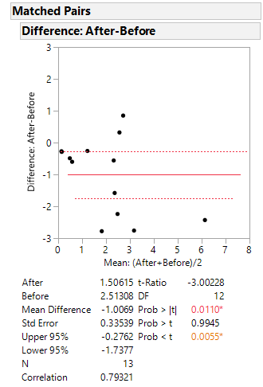

### Comparing Two Population Means: Paired Difference Experiments
To combat red-light-running crashes, many states are installing red light cameras at dangerous intersections. The Virginia Department of Transportation conducted a study in Fairfax County, Virginia to see if photo-red enforcement programs are effective in reducing red-light-running crashes at intersections. The study provides crash data (measured as the number of crashes caused by red light running per intersection per year) before and after installing red light cameras at 13 randomly selected intersections.

We will use a one sample t-test on the sample of differences to see if the true mean number of crashes at at intersections with installed cameras is less than the true mean number of crashes at intersections without cameras. 

### Assumptions Required for Valid Small-Sample Inferences about ud

1. The data must be paired.

2. A random sample of differences is selected from the target population of differences.

3. The population of differences has a distribution that is approximately normal.

Looking at the information provided, our data is paired since crash data was recorded twice at each intersection. Consequently, making a column of differences between crash data for each intersection can be regarded as a random sample of crash data differences for all intersections in Fairfax County, Virginia. Looking at a normal probability plot, we see that our data is a little off from being normal, but since t-test are robust against departures in normality, we will consider this and all assumptions to be fulfilled.

### Paired Difference Test of Hypothesis for ud = (u1 - u2)

First, we make a column of crash data differences (after cameras - before cameras). We will use our random sample of differences to make inferences about the mean of the population of differences, ud, which is equal to u1 - u2. u1 = the true mean number of crashes at at intersections with installed cameras in Fairfax County, Virginia and u2 = the true mean number of crashes at intersections without cameras in Fairfax County, Virginia. We are interested in whether red light cameras decrease the average amount of red-light-running crashes. We will use a level of significance of 0.01 for this test.

Ho: ud = 0

Ha: ud < 0 


### Small Sample Student's t-Test Statistic


Using the information above, our test statistic t = -1.006923/(1.2092517/sqrt(13)) = −3.002280259. Note that instead of n, we use nd which is the number of pairs. Looking at a table, we find the t-value corresponding to a = .01 and a df = 12 which is 2.681. Since -3.002280259 < -2.681, we have enough evidence to prove that the per year, the true average of red-light-running crashes for intersections with cameras installed in Fairfax County, VA is less than the true mean number of red-light-running crashes at intersections without cameras in Fairfax County, VA. Looking at a table, we see that our t statistic is between t(.010) and t(.005). This means that the p-value is between .010 and .005.

To find a 99% one sided confidence interval, we use the same confidence interval formula for one sample t-tests. We find that -1.006923 + 2.681(1.2092517/sqrt(13)) = (-Inf, -0.1077529259). We interpret this as per year, the true average of red-light-running crashes for intersections with cameras installed in Fairfax County, VA is (-Inf, -0.1077529259) less than the true mean number of red-light-running crashes at intersections without cameras in Fairfax County, VA.

Looking at the information below, our results agree with JMP.





We use the same code from our one sameple t-test project. The only difference is we calculate a column of differences, make sure `paired = TRUE` since we have paired data, and we make sure that x = after cameras group to agree with our null hypothesis. 


```

crash <- read.csv("REDLIT.csv",header = TRUE)


crash$diff <- crash$After-crash$Before
#  [1] -2.24 -0.27 -0.29 -2.76 -0.56  0.85  0.32 -0.49 -1.58 -2.78 -0.60 -0.26 -2.43


hist(crash$diff)

qqnorm(crash$diff)
qqline(crash$diff)


t.test(x = crash$After, y=crash$Before,alternative = "less",mu = 0,conf.level = .99,paired = TRUE)

### Paired t-test

### data:  crash$After and crash$Before
### t = -3.0023, df = 12, p-value = 0.00551
### alternative hypothesis: true difference in means is less than 0
### 99 percent confidence interval:
###       -Inf -0.1077537
### sample estimates:
### mean of the differences 
###        -1.006923 


